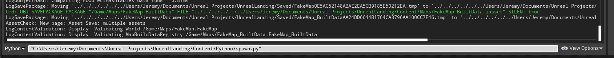

# What is it

This is a python script that will automatically place assets (meshes) randomly (within specified bounds) in a level. The assets are described in the `assets.json` with their placement bounds determined in `point_cloud_map.json`.  You also have the following abilities:

    * Assets can be placed randomly or follow a histogram distribution you provide
    * Assets can be rotated randomly
    * Properties can be changed randomly
    * Different forms of meshes of an assets can be chosen randomly (e.g many types (meshes) of ac units)
    * Materials can be changed randomly

## Installation

### Install Python Plugin

The Unreal Engine (as of 4.24) uses a built in python 2.7.14 interpreter (yuck Python 2). You must enable this interpreter as a plugin as shown [here](https://docs.unrealengine.com/en-US/Engine/Editor/ScriptingAndAutomation/Python/index.html). You **also need** the [Editor Scripting Utilities](https://docs.unrealengine.com/en-US/Engine/Editor/ScriptingAndAutomation/index.html) plugin. After enabling and restarting you can then access the interpreter after clicking
Window -> Developer Tools -> Output Log. You then switch to the tab for command prompt to python.

### Install Python Dependencies

The bundled Python engine (for Windows) is placed here: `C:\Program Files\Epic Games\UE_4.24\Engine\Binaries\ThirdParty\Python`.  This means we must install all dependencies here: `C:\Program Files\Epic Games\UE_4.24\Engine\Binaries\ThirdParty\Python\Win64\Lib\site-packages`. The list of dependencies needed are shown in the 

Here is the fastest way to install these dependencies into the unreal environment:

1. Install miniconda
2. Create a dummy virtual environment for the unreal engine - `conda create --name unreal_py2 python=2.7 --file spec-file.txt`
3. `pip install geojson`

All of your dependencies should now be in your python virtual environment `unreal_py2`. For me, this is the folder `C:\Users\Jeremy\Miniconda3\envs\unreal_py2\Lib\site-packages` . You now want to copy the these installed packages from your environments `site_packages` folder to the unreal engines `site_packages` folder. Skip any files that already exist (same name). See this picture below:

One more folder must be copied: `C:\Users\Jeremy\Miniconda3\envs\unreal_py2\Library`. This has a few binary dependencies.

Now reboot the unreal engine project. Note, linux will probably have totally different paths and possibly different places for the `site_packages` and shared libraries. You will have to copy those and also ensure the library path is updated in `update_paths` function in `spawn.py`.

## Use

Basic levels of using it are to simply launch the `spawn.py` file.  You do this by simply typing the file name: 

For details about asset spawning options see `levelgenerator/README.md`.
